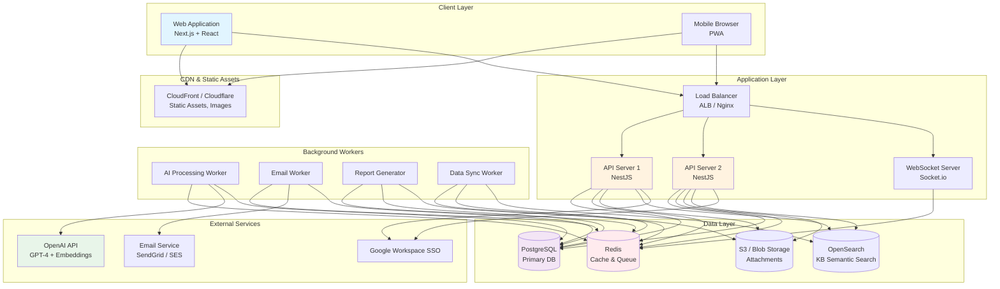
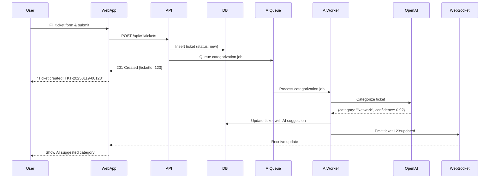
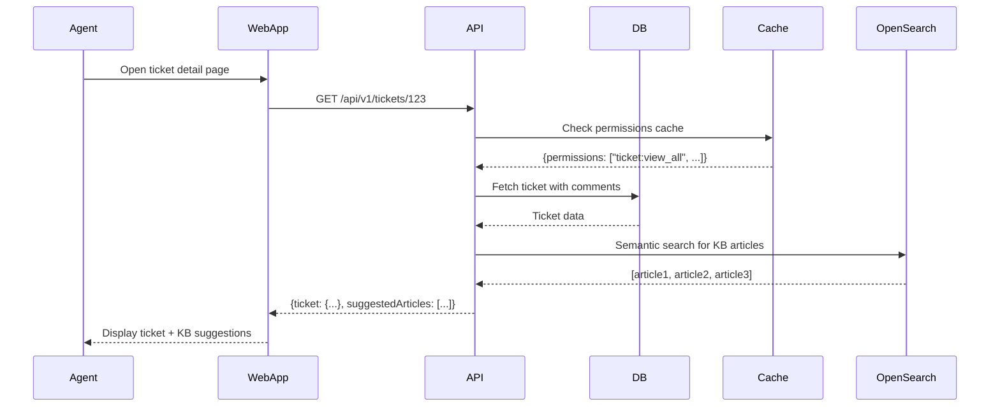
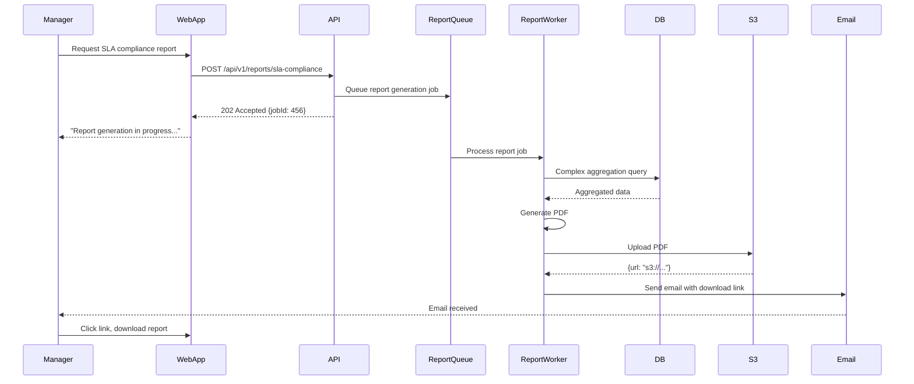

# AI-Powered IT Helpdesk - System Architecture

## 3. System Architecture

### 3.1 Architectural Style and Rationale

#### 3.1.1 Key Assumptions

**Scale Considerations:**
- Initial user base: 500-2,000 employees
- Expected ticket volume: 50-500 tickets/day
- Knowledge base: 100-500 articles initially, growing to 1,000+
- Expected growth: 2-3x over 3 years
- Team size: Small to medium engineering team (3-8 developers)

**Development Constraints:**
- Need to deliver MVP in 3-6 months
- Limited DevOps resources initially
- Must be maintainable by small team
- Budget-conscious (avoid over-engineering)

**Operational Requirements:**
- High availability target: 99.5% (acceptable brief downtime for maintenance)
- Response time: <500ms for typical user interactions
- Support for 200+ concurrent users during peak hours

#### 3.1.2 Recommended Architecture: Modular Monolith

**Decision: Start with a well-structured monolithic application, designed with clear module boundaries for potential future decomposition.**

**Why Not Microservices (Initially)?**

❌ **Microservices Drawbacks for This Use Case:**
- **Operational Complexity**: Requires sophisticated DevOps (Kubernetes, service mesh, distributed tracing)
- **Development Overhead**: More boilerplate code, inter-service communication, distributed transactions
- **Debugging Difficulty**: Tracking requests across 10+ services is complex
- **Resource Intensive**: Each service needs separate deployment, monitoring, scaling
- **Network Latency**: Inter-service calls add 50-200ms overhead
- **Overkill for Scale**: 500-2,000 users can easily be handled by a single well-optimized application

✅ **Modular Monolith Benefits:**
- **Simpler Deployment**: Single deployable artifact, easier rollback
- **Faster Development**: No network boundaries, shared database transactions
- **Lower Infrastructure Cost**: One application server vs 10+ containers
- **Easier Debugging**: Single codebase, unified logging
- **Future-Proof**: Clear module boundaries allow extraction to microservices if needed

**Modular Monolith Structure:**

```
helpdesk-application/
├── modules/
│   ├── auth/                 # Authentication & Authorization
│   │   ├── services/
│   │   ├── controllers/
│   │   └── models/
│   ├── ticketing/            # Core ticket management
│   │   ├── services/
│   │   ├── controllers/
│   │   └── models/
│   ├── knowledge-base/       # KB articles and search
│   ├── reporting/            # Analytics and reports
│   ├── ai-services/          # AI categorization, suggestions
│   ├── notifications/        # Email, in-app, webhooks
│   └── admin/                # System configuration
├── shared/                   # Shared utilities, types
├── infrastructure/           # Database, queue, cache clients
└── api/                      # API gateway/routing layer
```

**Module Communication Rules:**
- Modules communicate via well-defined interfaces (not direct DB access)
- Dependency injection for loose coupling
- Event bus for asynchronous communication between modules
- Each module could be extracted to a service in the future without major refactoring

**When to Consider Microservices Later:**
- User base grows to 10,000+
- Specific modules (e.g., AI service) need independent scaling
- Multiple teams working on different modules
- Different technology requirements per module (e.g., Python for AI, Node.js for API)

---

### 3.2 Frontend Architecture

#### 3.2.1 Technology Choice: React with Next.js

**Recommended Stack:**
- **Framework**: React 18+ with Next.js 14+
- **Language**: TypeScript (type safety, better IDE support)
- **State Management**: Zustand or Redux Toolkit
- **UI Component Library**: shadcn/ui (built on Radix UI + Tailwind CSS)
- **Forms**: React Hook Form with Zod validation
- **Data Fetching**: TanStack Query (React Query) for server state
- **Real-time**: Socket.io client or native WebSockets

**Rationale:**

✅ **React Ecosystem Benefits:**
- **Large Talent Pool**: Easy to hire React developers
- **Rich Ecosystem**: Thousands of libraries for charts, forms, tables, etc.
- **Component Reusability**: Build once, use everywhere
- **Performance**: Virtual DOM, React Server Components in Next.js

✅ **Next.js Benefits:**
- **Server-Side Rendering (SSR)**: Fast initial page load, better SEO for KB articles
- **API Routes**: Backend-for-frontend (BFF) pattern for simplified data fetching
- **File-based Routing**: Intuitive URL structure
- **Built-in Optimization**: Image optimization, code splitting, lazy loading
- **TypeScript Support**: First-class TypeScript integration

✅ **TypeScript Benefits:**
- **Type Safety**: Catch errors at compile time, not runtime
- **Better Refactoring**: IDE can safely rename across codebase
- **Self-Documenting**: Types serve as inline documentation
- **AI Integration**: Better autocomplete for AI API responses

**Alternative Considered:**
- **Vue.js with Nuxt**: Simpler learning curve, but smaller ecosystem
- **Angular**: Enterprise-grade, but heavier and steeper learning curve
- **Svelte with SvelteKit**: Excellent performance, but smaller community

#### 3.2.2 Frontend Application Structure

```
frontend/
├── src/
│   ├── app/                      # Next.js App Router
│   │   ├── (auth)/               # Auth-related pages (SSO, login)
│   │   ├── (dashboard)/          # Main app layout
│   │   │   ├── tickets/
│   │   │   │   ├── [id]/         # Ticket detail page
│   │   │   │   ├── new/          # Create ticket
│   │   │   │   └── page.tsx      # Ticket list
│   │   │   ├── kb/               # Knowledge base
│   │   │   ├── reports/          # Reports and analytics
│   │   │   └── admin/            # Admin pages
│   │   ├── api/                  # API routes (BFF)
│   │   └── layout.tsx            # Root layout
│   ├── components/
│   │   ├── ui/                   # shadcn/ui components
│   │   ├── tickets/              # Ticket-specific components
│   │   ├── kb/                   # KB components
│   │   └── shared/               # Shared components (header, sidebar)
│   ├── lib/
│   │   ├── api/                  # API client functions
│   │   ├── auth/                 # Auth utilities
│   │   └── utils/                # Helper functions
│   ├── hooks/                    # Custom React hooks
│   ├── stores/                   # Zustand stores
│   └── types/                    # TypeScript types
└── public/                       # Static assets
```

#### 3.2.3 State Management Strategy

**Three-Layer State Model:**

1. **Server State** (managed by TanStack Query):
   - Tickets, KB articles, user data, reports
   - Automatic caching, refetching, optimistic updates
   - Example:
     ```typescript
     const { data: ticket, isLoading } = useQuery({
       queryKey: ['ticket', ticketId],
       queryFn: () => fetchTicket(ticketId),
       staleTime: 30000, // Cache for 30 seconds
     });
     ```

2. **Client State** (managed by Zustand):
   - UI state: sidebar open/closed, modal visibility, filter settings
   - User preferences: theme, language, dashboard layout
   - Temporary form data (drafts)
   - Example:
     ```typescript
     const useUIStore = create((set) => ({
       sidebarOpen: true,
       toggleSidebar: () => set((state) => ({ sidebarOpen: !state.sidebarOpen })),
     }));
     ```

3. **URL State** (managed by Next.js router):
   - Current page, filters, search queries, sort order
   - Shareable and bookmarkable state
   - Example: `/tickets?status=open&priority=high&page=2`

**Why TanStack Query?**
- Eliminates manual loading/error states
- Automatic background refetching
- Optimistic updates (UI updates before server confirms)
- Request deduplication (multiple components requesting same data = one request)

#### 3.2.4 Role-Based UI Rendering

**Permission-Based Components:**

```typescript
// components/PermissionGate.tsx
export function PermissionGate({
  permission,
  children
}: {
  permission: string;
  children: React.ReactNode
}) {
  const { permissions } = useAuth(); // From decoded JWT

  if (!permissions.includes(permission)) {
    return null; // Don't render if no permission
  }

  return <>{children}</>;
}

// Usage in ticket detail page
<PermissionGate permission="ticket:reassign">
  <ReassignButton ticketId={ticket.id} />
</PermissionGate>
```

**Role-Based Layouts:**

```typescript
// Different dashboard layouts per role
export default function DashboardLayout({ children }: { children: React.ReactNode }) {
  const { role } = useAuth();

  return (
    <div className="flex">
      <Sidebar role={role} />
      <main className="flex-1">
        {role === 'admin' && <AdminHeader />}
        {role === 'team_lead' && <TeamLeadHeader />}
        {children}
      </main>
    </div>
  );
}
```

#### 3.2.5 Real-Time Updates

**Use Cases for Real-Time:**
- New ticket assigned to agent → Notification appears
- Ticket status changes → Update ticket list without refresh
- New comment added → Appear in ticket detail view
- SLA timer ticking down → Live countdown

**Implementation: WebSocket with Socket.io**

```typescript
// lib/socket.ts
import io from 'socket.io-client';

export const socket = io(process.env.NEXT_PUBLIC_WS_URL, {
  auth: {
    token: getAccessToken(), // JWT from cookie
  },
  reconnection: true,
  reconnectionAttempts: 5,
  reconnectionDelay: 1000,
});

// Subscribe to ticket updates
socket.on('ticket:updated', (data) => {
  // Invalidate React Query cache for this ticket
  queryClient.invalidateQueries(['ticket', data.ticketId]);
});

// Usage in component
useEffect(() => {
  socket.emit('subscribe:ticket', ticketId);

  return () => {
    socket.emit('unsubscribe:ticket', ticketId);
  };
}, [ticketId]);
```

**Alternative: Server-Sent Events (SSE)**
- Simpler than WebSocket, one-way server-to-client
- Built into HTTP, no special protocol needed
- Good for notifications, live updates
- Consideration: Less flexible than WebSocket (no client-to-server messages)

#### 3.2.6 Responsive Design and Mobile Support

**Design Targets:**
- Desktop: Primary experience (1920x1080, 1440x900)
- Tablet: Fully functional (768px+)
- Mobile: Core features only (375px+, iPhone SE minimum)

**Mobile-Specific Optimizations:**
- Bottom navigation for thumb-friendly access
- Swipe gestures for ticket actions (swipe to close, swipe to reassign)
- Progressive Web App (PWA) for offline ticket viewing
- Push notifications for critical alerts

**Tailwind CSS Responsive Classes:**
```tsx
<div className="
  grid grid-cols-1           /* Mobile: 1 column */
  md:grid-cols-2             /* Tablet: 2 columns */
  lg:grid-cols-3             /* Desktop: 3 columns */
  gap-4
">
  {tickets.map(ticket => <TicketCard key={ticket.id} ticket={ticket} />)}
</div>
```

---

### 3.3 Backend Architecture

#### 3.3.1 Technology Choice: Node.js with NestJS

**Recommended Stack:**
- **Runtime**: Node.js 20+ LTS
- **Framework**: NestJS (TypeScript-first, enterprise-grade)
- **Language**: TypeScript
- **ORM**: Prisma (type-safe database access)
- **API Style**: RESTful API with OpenAPI/Swagger documentation
- **Validation**: class-validator + class-transformer
- **Testing**: Jest + Supertest

**Rationale:**

✅ **Node.js Benefits:**
- **JavaScript Everywhere**: Same language as frontend (code reuse, shared types)
- **High Concurrency**: Event-driven, non-blocking I/O (ideal for I/O-heavy workload like database queries, AI API calls)
- **Rich Ecosystem**: npm has 2 million+ packages
- **Performance**: V8 engine highly optimized, fast for typical web app workloads
- **Async/Await**: Natural for handling multiple AI API calls, database queries concurrently

✅ **NestJS Benefits:**
- **TypeScript-First**: Full type safety from API to database
- **Modular Architecture**: Enforces clean separation of concerns (controllers, services, modules)
- **Dependency Injection**: Testable, maintainable code
- **Built-in Features**: Authentication, validation, caching, queues, WebSockets
- **Familiar for Java/C# Developers**: Similar to Spring Boot/ASP.NET Core
- **OpenAPI Integration**: Auto-generate API documentation

**Alternative Considered:**
- **Python with FastAPI**: Excellent for AI integration (natural with ML libraries), but slower for general web requests, weaker typing
- **Go with Gin/Echo**: Extremely fast, but smaller ecosystem, less familiar to JavaScript developers
- **Java with Spring Boot**: Enterprise-proven, but heavier, longer build times, verbose

#### 3.3.2 Backend Application Structure

```
backend/
├── src/
│   ├── modules/
│   │   ├── auth/
│   │   │   ├── auth.controller.ts    # Login, SSO, refresh token endpoints
│   │   │   ├── auth.service.ts       # Business logic
│   │   │   ├── auth.guard.ts         # JWT validation
│   │   │   ├── permissions.guard.ts  # RBAC enforcement
│   │   │   └── auth.module.ts
│   │   ├── tickets/
│   │   │   ├── tickets.controller.ts
│   │   │   ├── tickets.service.ts
│   │   │   ├── tickets.repository.ts # Database access layer
│   │   │   ├── dto/                  # Data Transfer Objects
│   │   │   │   ├── create-ticket.dto.ts
│   │   │   │   └── update-ticket.dto.ts
│   │   │   └── tickets.module.ts
│   │   ├── knowledge-base/
│   │   ├── reports/
│   │   ├── ai-services/
│   │   │   ├── categorization.service.ts
│   │   │   ├── kb-search.service.ts
│   │   │   ├── anomaly-detection.service.ts
│   │   │   └── ai.module.ts
│   │   ├── notifications/
│   │   │   ├── email.service.ts
│   │   │   ├── websocket.gateway.ts
│   │   │   └── notifications.module.ts
│   │   └── admin/
│   ├── common/
│   │   ├── decorators/           # Custom decorators (@Permissions, @CurrentUser)
│   │   ├── filters/              # Exception filters
│   │   ├── interceptors/         # Logging, caching
│   │   ├── pipes/                # Validation pipes
│   │   └── utils/
│   ├── config/                   # Configuration (database, Redis, AI API keys)
│   ├── database/
│   │   ├── migrations/
│   │   └── seeds/
│   ├── app.module.ts             # Root module
│   └── main.ts                   # Application entry point
├── prisma/
│   └── schema.prisma             # Database schema
├── test/
└── package.json
```

#### 3.3.3 API Design

**RESTful API Conventions:**

```
# Tickets
GET    /api/v1/tickets              # List tickets (with filters, pagination)
POST   /api/v1/tickets              # Create new ticket
GET    /api/v1/tickets/:id          # Get ticket details
PATCH  /api/v1/tickets/:id          # Update ticket
DELETE /api/v1/tickets/:id          # Delete ticket (admin only)
POST   /api/v1/tickets/:id/comments # Add comment to ticket
POST   /api/v1/tickets/:id/assign   # Assign ticket to agent
POST   /api/v1/tickets/:id/close    # Close ticket

# Knowledge Base
GET    /api/v1/kb/articles          # List articles
POST   /api/v1/kb/articles          # Create draft article
GET    /api/v1/kb/articles/:id      # Get article details
PATCH  /api/v1/kb/articles/:id      # Update article
POST   /api/v1/kb/articles/:id/publish  # Publish article
GET    /api/v1/kb/search?q=vpn      # Semantic search

# Reports
GET    /api/v1/reports/ticket-volume     # Ticket volume report
GET    /api/v1/reports/sla-compliance    # SLA compliance
GET    /api/v1/reports/agent-performance # Agent metrics
POST   /api/v1/reports/custom            # Custom report query
GET    /api/v1/reports/:id/export?format=csv  # Export report

# Admin
GET    /api/v1/admin/users          # List users
POST   /api/v1/admin/users          # Create user
PATCH  /api/v1/admin/users/:id/role # Change user role
GET    /api/v1/admin/audit-logs     # View audit logs
```

**API Versioning:**
- Version in URL path: `/api/v1/...`
- Allows breaking changes in v2 while maintaining v1 for backward compatibility
- Version deprecation: Give 6 months notice before removing old version

**Pagination:**
```json
GET /api/v1/tickets?page=2&limit=20&sort=-created_at&status=open

Response:
{
  "data": [/* 20 tickets */],
  "meta": {
    "page": 2,
    "limit": 20,
    "total": 150,
    "totalPages": 8
  },
  "links": {
    "first": "/api/v1/tickets?page=1&limit=20",
    "prev": "/api/v1/tickets?page=1&limit=20",
    "next": "/api/v1/tickets?page=3&limit=20",
    "last": "/api/v1/tickets?page=8&limit=20"
  }
}
```

**Error Responses:**
```json
{
  "statusCode": 403,
  "message": "Insufficient permissions to edit this ticket",
  "error": "Forbidden",
  "timestamp": "2025-01-19T15:30:00Z",
  "path": "/api/v1/tickets/12345"
}
```

**OpenAPI/Swagger Documentation:**
- Auto-generated from NestJS decorators
- Accessible at `/api/docs`
- Interactive API testing interface
- Used to generate TypeScript client for frontend

#### 3.3.4 Database Access Layer

**Prisma ORM Benefits:**
- **Type-Safe Queries**: TypeScript types auto-generated from schema
- **Intuitive API**:
  ```typescript
  const ticket = await prisma.ticket.findUnique({
    where: { id: ticketId },
    include: { comments: true, assignedAgent: true },
  });
  ```
- **Migrations**: Schema versioning and migration management
- **Query Optimization**: Prisma Studio for visual query debugging

**Repository Pattern:**

```typescript
// tickets/tickets.repository.ts
@Injectable()
export class TicketsRepository {
  constructor(private prisma: PrismaService) {}

  async findById(id: string, userId: string, permissions: string[]) {
    // Apply row-level security based on permissions
    const where: Prisma.TicketWhereInput = { id };

    if (!permissions.includes('ticket:view_all')) {
      if (permissions.includes('ticket:view_team')) {
        // Get user's team and filter by team
        where.team = { members: { some: { userId } } };
      } else {
        // Can only view own tickets
        where.createdBy = userId;
      }
    }

    return this.prisma.ticket.findUnique({ where });
  }

  async create(data: CreateTicketDto, createdBy: string) {
    return this.prisma.ticket.create({
      data: {
        ...data,
        createdBy,
        status: 'new',
        createdAt: new Date(),
      },
    });
  }
}

// tickets/tickets.service.ts
@Injectable()
export class TicketsService {
  constructor(
    private repository: TicketsRepository,
    private aiService: AiCategorizationService,
    private notificationService: NotificationService,
  ) {}

  async createTicket(data: CreateTicketDto, user: User) {
    // Get AI category suggestion
    const aiSuggestion = await this.aiService.categorizeTicket(data.title, data.description);

    // Create ticket with AI suggestion
    const ticket = await this.repository.create({
      ...data,
      suggestedCategory: aiSuggestion.category,
      suggestedPriority: aiSuggestion.priority,
      category: aiSuggestion.confidence > 0.85 ? aiSuggestion.category : null,
    }, user.id);

    // Send notification to assigned team
    await this.notificationService.notifyNewTicket(ticket);

    return ticket;
  }
}
```

---

### 3.4 Data Storage Architecture

#### 3.4.1 Primary Database: PostgreSQL

**Recommended Version**: PostgreSQL 15+ or 16+

**Why PostgreSQL?**

✅ **Feature-Rich:**
- **JSONB**: Store flexible data (ticket metadata, AI suggestions, audit logs) with indexing
- **Full-Text Search**: Built-in search capabilities (useful for basic KB search)
- **Transactions**: ACID compliance for data integrity
- **Extensions**: pgvector for semantic search, pg_cron for scheduled jobs
- **Mature**: 30+ years of development, battle-tested at scale

✅ **Performance:**
- Handles 10,000+ transactions per second on modern hardware
- Advanced indexing (B-tree, GiST, GIN, BRIN)
- Parallel query execution for complex reports

✅ **JSON Support:**
```sql
-- Store AI metadata as JSONB
CREATE TABLE tickets (
  id UUID PRIMARY KEY,
  title TEXT NOT NULL,
  ai_metadata JSONB,  -- { "category_confidence": 0.92, "suggested_kb_articles": [1,2,3] }
  ...
);

-- Query JSONB fields
SELECT * FROM tickets WHERE ai_metadata->>'category_confidence' > '0.8';

-- Index JSONB fields for fast queries
CREATE INDEX idx_tickets_ai_confidence ON tickets ((ai_metadata->>'category_confidence'));
```

**Alternative Considered:**
- **MySQL**: Solid choice, but JSON support and full-text search weaker
- **MongoDB**: Flexible schema, but lacks ACID transactions (critical for ticket data integrity)

#### 3.4.2 Database Schema Overview

**Core Tables:**

```sql
-- Users and Authentication
users, roles, permissions, role_permissions, user_roles, refresh_tokens, teams, team_members

-- Tickets
tickets, ticket_comments, ticket_attachments, ticket_history, ticket_tags, ticket_related

-- Knowledge Base
kb_articles, kb_article_versions, kb_article_tags, kb_categories, kb_article_ratings

-- Reporting and Analytics
ticket_metrics (pre-aggregated for fast reports), sla_events, agent_performance_snapshots

-- AI and ML
ai_predictions, ai_feedback, ai_model_versions

-- System
audit_logs, system_config, notification_preferences, email_queue
```

**Example: Tickets Table**

```sql
CREATE TABLE tickets (
  id UUID PRIMARY KEY DEFAULT gen_random_uuid(),
  ticket_number VARCHAR(20) UNIQUE NOT NULL,  -- TKT-20250119-00042

  -- Core fields
  title VARCHAR(500) NOT NULL,
  description TEXT NOT NULL,
  status VARCHAR(50) NOT NULL,  -- new, open, in_progress, pending_user, resolved, closed
  priority VARCHAR(20) NOT NULL,  -- critical, high, medium, low
  category_id UUID REFERENCES ticket_categories(id),

  -- Users
  created_by UUID REFERENCES users(id) NOT NULL,
  assigned_to UUID REFERENCES users(id),
  team_id UUID REFERENCES teams(id),

  -- SLA
  sla_response_deadline TIMESTAMP,
  sla_resolution_deadline TIMESTAMP,
  first_response_at TIMESTAMP,
  resolved_at TIMESTAMP,
  closed_at TIMESTAMP,
  sla_paused BOOLEAN DEFAULT FALSE,
  sla_pause_reason VARCHAR(100),

  -- AI metadata
  ai_suggested_category UUID REFERENCES ticket_categories(id),
  ai_suggested_priority VARCHAR(20),
  ai_confidence NUMERIC(3,2),  -- 0.00 to 1.00
  ai_model_version VARCHAR(50),

  -- Timestamps
  created_at TIMESTAMP DEFAULT NOW(),
  updated_at TIMESTAMP DEFAULT NOW(),

  -- Search
  search_vector TSVECTOR,  -- Full-text search index

  -- Soft delete
  deleted_at TIMESTAMP
);

-- Indexes for performance
CREATE INDEX idx_tickets_status ON tickets(status) WHERE deleted_at IS NULL;
CREATE INDEX idx_tickets_assigned ON tickets(assigned_to) WHERE deleted_at IS NULL;
CREATE INDEX idx_tickets_created_by ON tickets(created_by);
CREATE INDEX idx_tickets_team ON tickets(team_id);
CREATE INDEX idx_tickets_created_at ON tickets(created_at DESC);
CREATE INDEX idx_tickets_sla_response ON tickets(sla_response_deadline) WHERE first_response_at IS NULL;
CREATE INDEX idx_tickets_search ON tickets USING GIN(search_vector);

-- Trigger to update search_vector
CREATE TRIGGER tickets_search_update BEFORE INSERT OR UPDATE ON tickets
FOR EACH ROW EXECUTE FUNCTION
  tsvector_update_trigger(search_vector, 'pg_catalog.english', title, description);
```

**Example: Audit Logs Table (Immutable)**

```sql
CREATE TABLE audit_logs (
  id UUID PRIMARY KEY DEFAULT gen_random_uuid(),
  timestamp TIMESTAMP DEFAULT NOW(),
  user_id UUID REFERENCES users(id),
  user_email VARCHAR(255),
  action VARCHAR(100) NOT NULL,  -- 'ticket:update', 'user:role_change', etc.
  resource_type VARCHAR(50) NOT NULL,  -- 'ticket', 'user', 'kb_article'
  resource_id UUID,
  details JSONB,  -- Flexible structure for action-specific data
  ip_address INET,
  user_agent TEXT,
  result VARCHAR(20) DEFAULT 'success'  -- success, failure, partial
);

-- Partition by month for performance (keep hot data in recent partitions)
CREATE TABLE audit_logs_2025_01 PARTITION OF audit_logs
  FOR VALUES FROM ('2025-01-01') TO ('2025-02-01');

-- Index for common queries
CREATE INDEX idx_audit_logs_user ON audit_logs(user_id, timestamp DESC);
CREATE INDEX idx_audit_logs_resource ON audit_logs(resource_type, resource_id);
CREATE INDEX idx_audit_logs_action ON audit_logs(action);
```

#### 3.4.3 Caching Layer: Redis

**Use Cases:**

1. **Session Storage** (optional, if not using JWT-only):
   - Store active sessions for quick validation
   - Key: `session:{sessionId}`, Value: `{userId, role, permissions}`
   - TTL: 30 minutes (matches access token lifetime)

2. **Rate Limiting**:
   - Track API requests per user/IP
   - Key: `ratelimit:{userId}:{endpoint}`, Value: request count
   - TTL: 1 minute (sliding window)

3. **Caching Frequently Accessed Data**:
   - User permissions: `user:{userId}:permissions`
   - System configuration: `config:sla_policies`
   - Featured KB articles: `kb:featured`
   - TTL: 5-60 minutes depending on data

4. **Real-Time Counters**:
   - Open tickets per team: `team:{teamId}:open_tickets`
   - Agents online: `agents:online` (sorted set)

**Redis Example:**

```typescript
// Caching user permissions
@Injectable()
export class PermissionsService {
  constructor(
    private prisma: PrismaService,
    private redis: Redis,
  ) {}

  async getUserPermissions(userId: string): Promise<string[]> {
    const cacheKey = `user:${userId}:permissions`;

    // Check cache first
    const cached = await this.redis.get(cacheKey);
    if (cached) {
      return JSON.parse(cached);
    }

    // Cache miss, fetch from database
    const permissions = await this.prisma.permission.findMany({
      where: {
        roles: {
          some: {
            users: {
              some: { userId },
            },
          },
        },
      },
    });

    const permissionNames = permissions.map(p => p.name);

    // Store in cache for 15 minutes
    await this.redis.setex(cacheKey, 900, JSON.stringify(permissionNames));

    return permissionNames;
  }

  async invalidateUserPermissionsCache(userId: string) {
    await this.redis.del(`user:${userId}:permissions`);
  }
}
```

**Redis Deployment:**
- Use managed Redis (AWS ElastiCache, Azure Cache for Redis, Redis Cloud)
- Single instance sufficient initially (can add read replicas later)
- Persistence: Append-only file (AOF) for durability

#### 3.4.4 Search Engine: OpenSearch / Elasticsearch

**Why Separate Search Engine?**

- PostgreSQL full-text search is good for basic queries
- For advanced semantic search over KB, need vector similarity search
- Elasticsearch/OpenSearch provide:
  - Advanced full-text search (fuzzy matching, synonyms, boosting)
  - Vector search (with k-NN plugin for semantic search)
  - Faceted search (filter by category, date, author simultaneously)
  - Highlighting (show matched text in search results)

**Recommendation: OpenSearch** (AWS fork of Elasticsearch, fully open-source)

**Use Cases:**

1. **Knowledge Base Semantic Search**:
   - Store KB article embeddings
   - Query: "wifi not working" → Find articles about wireless connectivity
   - k-NN search with cosine similarity

2. **Ticket Search**:
   - Search across title, description, comments
   - Fuzzy matching for typos
   - Filter by status, priority, date range simultaneously

**OpenSearch Index Structure:**

```json
// KB Articles Index
{
  "mappings": {
    "properties": {
      "id": { "type": "keyword" },
      "title": {
        "type": "text",
        "analyzer": "english",
        "fields": {
          "keyword": { "type": "keyword" }
        }
      },
      "content": { "type": "text", "analyzer": "english" },
      "summary": { "type": "text" },
      "category": { "type": "keyword" },
      "tags": { "type": "keyword" },
      "published_at": { "type": "date" },
      "view_count": { "type": "integer" },
      "rating": { "type": "float" },

      // Vector embedding for semantic search (1536 dimensions for OpenAI text-embedding-3-large)
      "embedding": {
        "type": "knn_vector",
        "dimension": 1536,
        "method": {
          "name": "hnsw",
          "engine": "faiss",
          "parameters": {
            "ef_construction": 512,
            "m": 16
          }
        }
      }
    }
  }
}
```

**Semantic Search Query:**

```typescript
async semanticKBSearch(query: string): Promise<KBArticle[]> {
  // 1. Generate embedding for search query
  const queryEmbedding = await this.openai.embeddings.create({
    model: 'text-embedding-3-large',
    input: query,
  });

  // 2. k-NN search in OpenSearch
  const response = await this.opensearch.search({
    index: 'kb_articles',
    body: {
      size: 10,
      query: {
        knn: {
          embedding: {
            vector: queryEmbedding.data[0].embedding,
            k: 10,
          },
        },
      },
      _source: ['id', 'title', 'summary', 'category'],
    },
  });

  return response.hits.hits.map(hit => hit._source);
}
```

**Data Synchronization:**
- Use database triggers or event-driven approach to sync Postgres → OpenSearch
- When KB article published/updated → Send to message queue → Worker updates OpenSearch index
- Periodic full re-index (weekly) to ensure consistency

**Alternative: PostgreSQL pgvector Extension**
- If budget-constrained or prefer simpler architecture
- pgvector adds vector similarity search to Postgres
- Good for moderate scale (10K-100K documents)
- Example:
  ```sql
  CREATE EXTENSION vector;

  CREATE TABLE kb_articles (
    id UUID PRIMARY KEY,
    title TEXT,
    embedding vector(1536)  -- 1536-dimensional vector
  );

  CREATE INDEX ON kb_articles USING ivfflat (embedding vector_cosine_ops);

  -- Semantic search
  SELECT id, title, 1 - (embedding <=> query_embedding) AS similarity
  FROM kb_articles
  ORDER BY embedding <=> query_embedding
  LIMIT 10;
  ```

#### 3.4.5 Object Storage: AWS S3 / Azure Blob Storage

**Use Cases:**
- Ticket attachments (screenshots, logs, documents)
- KB article images and videos
- Exported reports (CSV, PDF)
- User profile pictures (if not using SSO provider's picture)

**Storage Organization:**

```
s3://digiskills-helpdesk-prod/
├── tickets/
│   └── {ticketId}/
│       ├── attachment1.png
│       └── attachment2.log
├── kb-articles/
│   └── {articleId}/
│       ├── screenshot1.png
│       └── tutorial-video.mp4
├── reports/
│   └── {year}/{month}/
│       └── sla-report-2025-01.pdf
└── avatars/
    └── {userId}.jpg
```

**Security:**
- Bucket not publicly accessible
- Backend generates **pre-signed URLs** for time-limited access (valid for 15 minutes)
- User downloads file via pre-signed URL directly from S3 (no traffic through backend)

**Pre-Signed URL Example:**

```typescript
@Get('tickets/:ticketId/attachments/:attachmentId')
async getAttachment(
  @Param('ticketId') ticketId: string,
  @Param('attachmentId') attachmentId: string,
  @CurrentUser() user: User,
) {
  // Verify user has permission to view this ticket
  await this.permissionsService.verifyTicketAccess(ticketId, user);

  // Get attachment metadata from database
  const attachment = await this.prisma.ticketAttachment.findUnique({
    where: { id: attachmentId },
  });

  // Generate pre-signed URL (expires in 15 minutes)
  const url = await this.s3.getSignedUrlPromise('getObject', {
    Bucket: 'digiskills-helpdesk-prod',
    Key: `tickets/${ticketId}/${attachment.filename}`,
    Expires: 900, // 15 minutes
  });

  return { url };
}
```

**Cost Optimization:**
- Use lifecycle policies: Move old attachments (>1 year) to Glacier/Archive tier
- Compress images on upload (reduce size without losing quality)

---

### 3.5 AI & Integration Layer

#### 3.5.1 AI Service Architecture

**Approach: AI as a Separate Service Module (within monolith initially)**

```
modules/ai-services/
├── categorization.service.ts       # Ticket categorization
├── kb-search.service.ts            # Semantic KB search
├── anomaly-detection.service.ts    # Spike detection
├── openai.client.ts                # OpenAI API wrapper
├── embeddings.service.ts           # Generate and cache embeddings
└── ai.module.ts
```

**Service Integration Pattern:**

```typescript
// ai-services/categorization.service.ts
@Injectable()
export class CategorizationService {
  constructor(
    private openai: OpenAIClient,
    private prisma: PrismaService,
    private cache: Redis,
  ) {}

  async categorizeTicket(title: string, description: string): Promise<CategoryPrediction> {
    // Call OpenAI API for zero-shot classification
    const prompt = `
      Classify the following IT helpdesk ticket into one of these categories:
      - Hardware
      - Software
      - Network
      - Internet
      - Access

      Ticket Title: ${title}
      Description: ${description}

      Return JSON: { "category": "...", "subcategory": "...", "confidence": 0.0-1.0, "reasoning": "..." }
    `;

    const response = await this.openai.chat.completions.create({
      model: 'gpt-4-turbo',
      messages: [{ role: 'user', content: prompt }],
      response_format: { type: 'json_object' },
      temperature: 0.3, // Lower temperature for more consistent classification
    });

    const prediction = JSON.parse(response.choices[0].message.content);

    // Store prediction in database for feedback loop
    await this.prisma.aiPrediction.create({
      data: {
        type: 'categorization',
        input: { title, description },
        output: prediction,
        modelVersion: 'gpt-4-turbo-2024-04',
      },
    });

    return prediction;
  }

  async recordFeedback(predictionId: string, actualCategory: string, accepted: boolean) {
    // Store agent feedback for model retraining
    await this.prisma.aiFeedback.create({
      data: {
        predictionId,
        actualCategory,
        accepted,
      },
    });
  }
}
```

#### 3.5.2 Message Queue for Asynchronous Processing

**Why Message Queue?**
- AI API calls can be slow (1-5 seconds)
- Report generation can take 10-30 seconds
- Email sending should not block API response
- Retry failed operations automatically

**Recommended: BullMQ (Redis-based queue for Node.js)**

**Use Cases:**

1. **AI Processing Queue**:
   - Ticket created → Add to queue → Worker calls AI categorization → Update ticket
   - Benefit: User gets instant ticket creation response, AI processes in background

2. **Email Queue**:
   - Ticket status changed → Add to queue → Worker sends email to user
   - Retry failed emails (SMTP server down)

3. **Report Generation Queue**:
   - User requests large report → Job queued → Worker generates and emails download link
   - Prevents timeout on long-running requests

4. **Data Sync Queue**:
   - KB article published → Queue job to index in OpenSearch
   - Embedding generation (batch process for new articles)

**Queue Structure:**

```typescript
// queues/ai-queue.ts
import { Queue, Worker } from 'bullmq';

const aiQueue = new Queue('ai-processing', {
  connection: redisConnection,
});

// Producer: Add job to queue
export async function queueTicketCategorization(ticketId: string, title: string, description: string) {
  await aiQueue.add('categorize-ticket', {
    ticketId,
    title,
    description,
  }, {
    attempts: 3, // Retry up to 3 times
    backoff: {
      type: 'exponential',
      delay: 2000, // 2s, 4s, 8s
    },
  });
}

// Consumer: Process jobs
const aiWorker = new Worker('ai-processing', async (job) => {
  if (job.name === 'categorize-ticket') {
    const { ticketId, title, description } = job.data;

    // Call AI service
    const prediction = await categorizationService.categorizeTicket(title, description);

    // Update ticket with prediction
    await prisma.ticket.update({
      where: { id: ticketId },
      data: {
        aiSuggestedCategory: prediction.category,
        aiConfidence: prediction.confidence,
        // Auto-assign if confidence > 85%
        category: prediction.confidence > 0.85 ? prediction.category : null,
      },
    });

    // Notify frontend via WebSocket
    websocketGateway.emit(`ticket:${ticketId}:updated`, { category: prediction.category });
  }
}, {
  connection: redisConnection,
  concurrency: 5, // Process 5 jobs concurrently
});
```

**Job Monitoring:**
- BullMQ Board (web UI) to monitor queue health
- Metrics: Jobs completed, failed, processing time
- Alerts: Queue backlog > 100 jobs, high failure rate

---

### 3.6 High-Level Architecture Diagram



---

### 3.7 Request Flow Examples

#### Example 1: User Creates Ticket



#### Example 2: Agent Views Ticket with KB Suggestions



#### Example 3: Management Generates Report



---

## Summary

**Architecture Decisions:**
- **Architectural Style**: Modular monolith (simple, cost-effective, future-proof)
- **Frontend**: React + Next.js + TypeScript (modern, performant, great DX)
- **Backend**: Node.js + NestJS + TypeScript (scalable, maintainable, same language as frontend)
- **Primary DB**: PostgreSQL (reliable, feature-rich, ACID compliance)
- **Cache**: Redis (fast, versatile, battle-tested)
- **Search**: OpenSearch with pgvector fallback (semantic search for KB)
- **Object Storage**: S3/Azure Blob (scalable, cost-effective)
- **Message Queue**: BullMQ (async processing, retry logic)
- **AI Integration**: OpenAI API (fast time-to-market, high quality)

This architecture balances **simplicity, performance, and scalability**, allowing a small team to deliver a production-ready helpdesk system in 3-6 months while maintaining flexibility to scale as Digiskills.pk grows.
